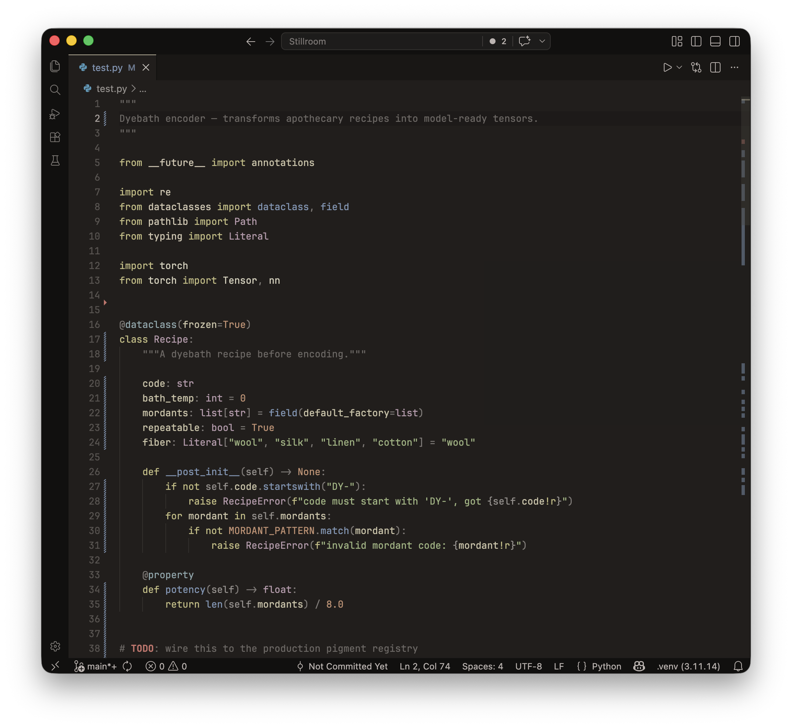
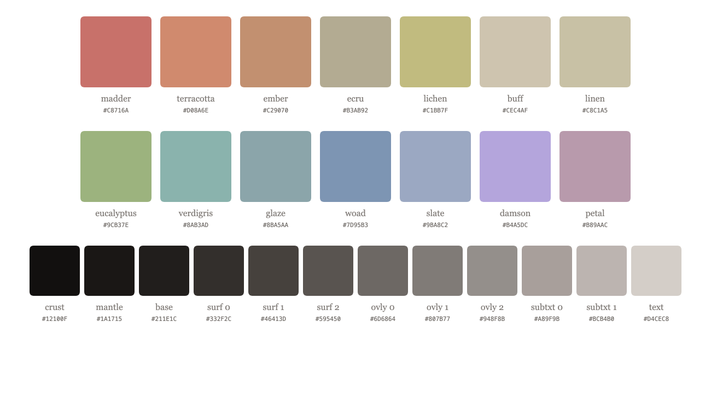

# Stillroom

A theme inspired by natural dyes and warm stone. Calibrated for a grounding developer experience.

## The Palette

## Ports

| Surface | Theme |
| ------- | ----- |
| VS Code | [`vscode/themes/stillroom-color-theme.json`](vscode/themes/stillroom-color-theme.json) |
| Zed | [`zed/themes/stillroom.json`](zed/themes/stillroom.json) |
| Ghostty | [`ghostty/stillroom`](ghostty/stillroom) |
| Slack | [`slack/slack.md`](slack/slack.md) |
| Linear | [`linear/linear.md`](linear/linear.md) |
| Chrome | [`chrome/manifest.json`](chrome/manifest.json) |

## Variants

Currently a single variant. Future releases are planned to expand the palette and contrast options.

- `Stillroom · Steep` — current, dark.

### Upcoming 

- `Stillroom · Decant` — light.
- `Stillroom · Mordant` — high-contrast.
